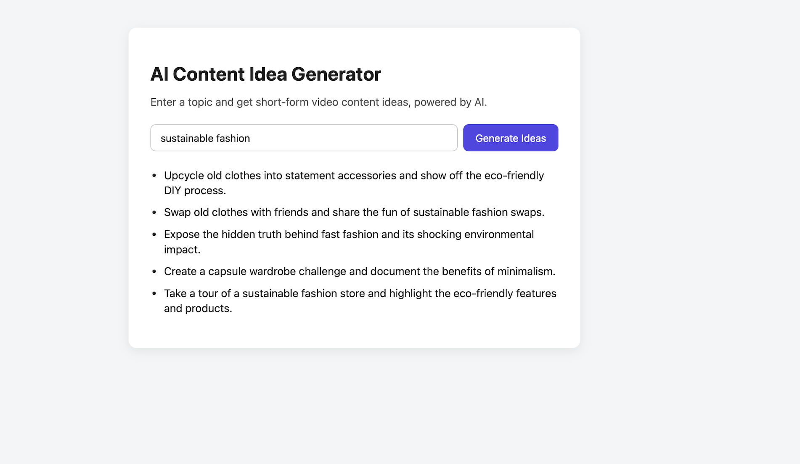

# AI Content Idea Generator 🎬✨

A small full-stack app that generates short-form video content ideas (TikTok/Reels/Shorts style)
for any topic, using an LLM API. Built as a portfolio project to practice integrating a
**React frontend** with a **Python (FastAPI) backend** and a **Generative AI API**.

## Demo



## Tech Stack

- **Frontend:** React, Vite, fetch API
- **Backend:** Python, FastAPI, Uvicorn
- **AI:** Groq API (llama-3.1-8b-instant, free tier)

## Why I built this

I wanted hands-on practice with a full-stack AI product: a React UI talking to a Python
API that itself talks to an LLM. It's a simplified version of the kind of "idea → content"
pipeline used by AI content/video tools.

## Project Structure

```
ai-content-idea-generator/
├── backend/
│   ├── main.py            # FastAPI app + /api/generate-ideas endpoint
│   ├── requirements.txt
│   └── .env.example
└── frontend/
    ├── src/
    │   ├── App.jsx         # Main UI component
    │   ├── main.jsx
    │   └── index.css
    ├── index.html
    ├── package.json
    └── vite.config.js
```

## Getting Started

### Backend

```bash
cd backend
python -m venv venv
source venv/bin/activate   # Windows: venv\Scripts\activate
pip install -r requirements.txt
cp .env.example .env       # add your Groq API key (free at console.groq.com/keys)
uvicorn main:app --reload --port 8000
```

### Frontend

```bash
cd frontend
npm install
npm run dev
```

Open the app at `http://localhost:5173` — make sure the backend is running on
`http://localhost:8000`.

## API

`POST /api/generate-ideas`

```json
{
  "topic": "sustainable fashion",
  "count": 5
}
```

Response:

```json
{
  "ideas": [
    "Upcycle old clothes into statement accessories and show off the eco-friendly DIY process.",
    "..."
  ]
}
```

## Possible Next Steps

- Add idea history / saved favorites (would need a database, e.g. Supabase/PostgreSQL)
- Add a "regenerate" button per idea
- Support generating a short script per idea, not just a one-liner
- Deploy frontend (Vercel) + backend (Railway/Render)

## License

MIT
